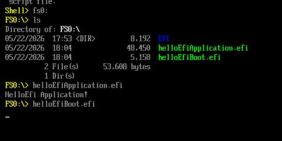

# Uefi-Playground

Minimal UEFI application written in C,
bootable in QEMU using OVMF firmware.

This project explores:
- UEFI applications
- low-level boot environments
- firmware interfaces
- QEMU-based system emulation

Main goal is to see differences between a simple Application inside UEFI and a bootable Executable.

# Resources/ Documentation

https://uefi.org
https://wiki.osdev.org/UEFI
https://sourceforge.net/projects/gnu-efi/

Main Documentation:  
https://uefi.org/sites/default/files/resources/UEFI_Spec_Final_2.11.pdf


# Explanation Difference between Application and Bootable

# Screenshot
Bootscreen in QEMU




# Architecture
Host Linux  ->  Build EFI Binary  ->  QEMU + OVMF  ->  UEFI Application  

# Dependencies

Ubuntu/Debian:
```bash
sudo apt install ovmf qemu-system-x86 gnu-efi 
```

# Build Instructions
```bash
make run
```

# UEFI Interactive Shell - commands
Switch HD: ```fs0:```
List files: ```ls```
To leave shell: ```exit```
