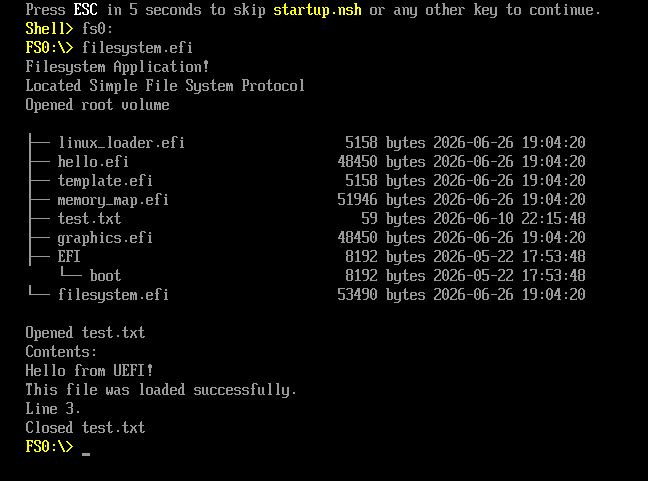
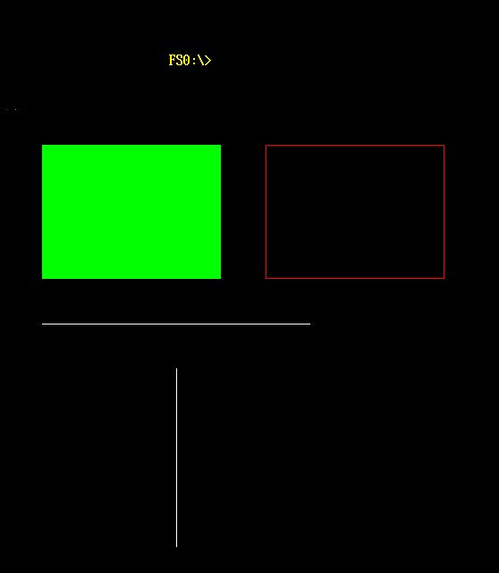

# Uefi-Playground

Minimal UEFI application written in C,
bootable in QEMU using OVMF firmware.

This project explores:
- UEFI applications
- low-level boot environments
- firmware interfaces
- QEMU-based system emulation

Main goal is to see differences between a simple Application inside UEFI and a bootable Executable.

## Current Features

### Applications
- Hello World application
- Memory Map Viewer
  - Retrieves the UEFI memory map via `GetMemoryMap()`
  - Displays memory regions and sizes
  - Groups contiguous memory regions of the same type
  - Uses color-coded output for improved readability
 - Filesystem Explorer
  	- Locates the Simple File System Protocol
  	- Opens the root volume
  	- Enumerates directories recursively
  	- Displays file metadata
  	- Reads file contents
 - Graphics Output (GOP) Demo
  - Accesses EFI_GRAPHICS_OUTPUT_PROTOCOL
  - Retrieves framebuffer base address and configuration
  - Draws directly to framebuffer memory
  - Implements pixel-level rendering (PutPixel)
  - Implements primitive shapes (lines, rectangles, filled areas)
  - Demonstrates UI separation via screen offset (console vs graphics area)
 - Runs in QEMU using OVMF with 32-bit framebuffer access

### Boot Loaders
- Template boot loader
- Linux loader (work in progress)

# Resources/ Documentation

https://uefi.org  
https://wiki.osdev.org/UEFI  
https://sourceforge.net/projects/gnu-efi/  

## UEFI 2.11 Specification
https://uefi.org/sites/default/files/resources/UEFI_Spec_Final_2.11.pdf


# UEFI Application vs Bootable Firmware Entry

UEFI distinguishes between *applications* and *bootable loaders*, even though both are compiled as `.efi` binaries.

## UEFI Application
A UEFI application is executed by an already running UEFI firmware environment.

- Started manually from the UEFI shell or boot manager
- Runs with full access to Boot Services
- Uses the existing system context (no system takeover)
- Example: memory map viewer, filesystem tools, diagnostics

## Bootable EFI Loader
A bootable EFI image acts as a **boot entry point for an operating system**.

- Executed automatically by the firmware during boot
- Responsible for preparing system handoff to an OS
- Typically loads a kernel or continues the boot chain
- Runs early in the boot process before ExitBootServices()

## Key Difference
The main difference is **role in the boot process**:
- Applications run *on top of firmware*
- Bootable loaders *transition from firmware to OS*

Both use the same UEFI interfaces, but operate at different stages of system initialization.

## Learning Focus of this Project
This project is intentionally focused on low-level firmware behaviour and UEFI-specific details, including:

- Boot Services lifecycle and constraints
- Memory management via 'GetMemoryMap'
- Calling conventions and ABI compatibility berween GNU-EFI and firmware services
- Investigating issues caused by incorrect parameter layouts and calling conventions
- Differences between firmware execution contexts and OS handoff
- Debugging behaviour in QEMU/OVMF environments
- UEFI filesystem protocols and directory traversal

A key goal is to understand subtle implementation details that are often abstracted away in higher-level systems programming, such as why certain UEFI calls may behave differently depending on parameter layout or compiler/API configuration.

# Screenshots
## Example Output


## Memory Map Viewer


## Filesystem Explorer



## Graphics Output Protocol Demo




# Architecture
```text
Host Linux  
    |  
    +--> UEFI Applications
	|		+--> Hello World
	|		+--> Memory Map Viewer
	|		+--> Filesystem Explorer
	|		+--> GOP Graphics Demo
    |  
    +--> Boot Loader  
            |  
            +--> Linux Loader (planned)  
```

# Roadmap

## Completed
- Project setup
- QEMU + OVMF environment
- Hello World application
- Memory Map Viewer
- Filesystem Explorer
- GOP Graphics Demo (basic rendering)

## Planned
- Linux kernel loader
- ExitBootServices() handoff
- Connection to GDB

# Dependencies

Ubuntu/Debian:
```bash
sudo apt install ovmf qemu-system-x86 gnu-efi 
```

# Build Instructions
Build all EFI binaries and start QEMU:
```bash
make run
```

# UEFI Interactive Shell - commands
Switch HD: ```fs0:```  
List files: ```ls```  
To leave shell: ```exit```  
