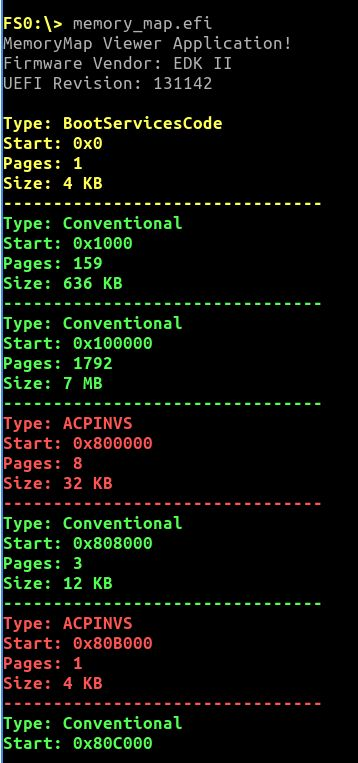

# Memory Map Viewer

## Overview

The Memory Map Viewer is a UEFI application that retrieves and displays the firmware memory map.

It demonstrates how UEFI exposes the current system memory layout before an operating system takes control.

---

## Goal

The goal of this application is to understand how firmware manages memory and how an operating system loader can retrieve this information before calling `ExitBootServices()`.

---

## What it demonstrates

- Calling `GetMemoryMap()`
- Allocating memory using `AllocatePool()`
- Handling EFI memory descriptors
- Iterating descriptors using `DescriptorSize`
- Converting memory types into readable names
- Grouping contiguous memory regions
- Displaying formatted output in the UEFI console

---

## UEFI Memory Map

The UEFI memory map describes how physical memory is currently used by the firmware.

Each entry is an `EFI_MEMORY_DESCRIPTOR` containing information such as:

- Memory type
- Physical start address
- Number of pages
- Memory attributes

A simplified example:

```text
Memory Type        Start Address        Size

Loader Code       0x00000000A0000000   64 KB
Boot Services     0x00000000B0000000   2 MB
Conventional RAM  0x00000001C0000000   512 MB
```

## GetMemoryMap Workflow

GetMemoryMap() requires a specific workflow.

The application must first query the required buffer size:

```text
Call GetMemoryMap()

        |
        v

EFI_BUFFER_TOO_SMALL

        |
        v

Allocate buffer

        |
        v

Call GetMemoryMap() again

        |
        v

Process descriptors
```

## Memory Allocation Considerations

An important detail is that allocating the memory map buffer changes the memory map itself.

This means the typical workflow is:

1. Request the required size
2. Add additional space for changes
3. Allocate the buffer
4. Retrieve the final memory map

Example:

```c
MemoryMapSize += 2 * DescriptorSize;
```
The additional space prevents allocation changes from invalidating the second call.

## Descriptor Iteration

EFI memory descriptors must not be iterated using normal pointer arithmetic:

```c
Descriptor++;
```

The descriptor size is firmware-defined.

The correct approach is:

```c
Descriptor =
    (EFI_MEMORY_DESCRIPTOR*)
    (
        (UINT8*)Descriptor + DescriptorSize
    );
```

This allows the application to work with different firmware implementations.

## Output

The application displays:

- Memory type
- Physical address
- Page count
- Calculated size

Contiguous regions of the same memory type are grouped together to improve readability.

Example output:



## Related Concepts
- [Memory Map](../concepts/memory-map.md)
- [Boot Services](../concepts/boot-services.md)
- [GetMemoryMap() Findings](../findings/getmemorymap.md)

## Next Steps

The next application explores filesystem access through UEFI protocols:

[Filesystem Explorer](efi_file_info.md)